# Sistema de Notificaciones Universitarias

Este proyecto es una API REST desarrollada con **Java**, **Spring Boot**, y **PostgreSQL** utilizando **Spring Data JPA**. El objetivo principal es gestionar y enviar notificaciones a los usuarios de la universidad según diversas situaciones y mediante diferentes canales (correo electrónico, SMS, y aplicación móvil).

Se ha aplicado el **Patrón de Diseño Strategy** junto con **Polimorfismo (Herencia de Entidades)** para garantizar que el sistema pueda crecer fácilmente incorporando nuevos medios de notificación en el futuro sin modificar el código core (Open/Closed Principle).

*Nota: Este proyecto fue desarrollado completamente SIN utilizar Lombok, como fue solicitado.*

---

## 1. Diagrama de Clases

A continuación se presenta la representación del diagrama de clases (utilizando la sintaxis de Mermaid) para que puedas trasladarlo fácilmente a papel o visualizarlo directamente.

```mermaid
classDiagram
    %% --- Enums ---
    class NotificationStatus {
        <<enumeration>>
        PENDING
        SENT
        FAILED
    }
z
    class NotificationSituation {
        <<enumeration>>
        GRADES_PUBLISHED
        TUITION_PAYMENT_REMINDER
        CLASS_CANCELLATION
        EVENT_CONFIRMATION
    }

    %% --- Models (Entities) ---
    class Notification {
        <<abstract>>
        - Long id
        - String code
        - String recipient
        - String message
        - LocalDateTime sendDate
        - NotificationStatus status
        - NotificationSituation situation
        + Notification()
        + Notification(String code, String recipient, String message, LocalDateTime sendDate, NotificationStatus status, NotificationSituation situation)
        + getId(): Long
        + setId(Long id): void
        + getCode(): String
        + setCode(String code): void
        + getRecipient(): String
        + setRecipient(String recipient): void
        + getMessage(): String
        + setMessage(String message): void
        + getSendDate(): LocalDateTime
        + setSendDate(LocalDateTime sendDate): void
        + getStatus(): NotificationStatus
        + setStatus(NotificationStatus status): void
        + getSituation(): NotificationSituation
        + setSituation(NotificationSituation situation): void
    }

    class EmailNotification {
        - String subject
        - String cc
        + EmailNotification()
        + EmailNotification(String code, String recipient, String message, LocalDateTime sendDate, NotificationStatus status, NotificationSituation situation, String subject, String cc)
        + getSubject(): String
        + setSubject(String subject): void
        + getCc(): String
        + setCc(String cc): void
    }

    class SmsNotification {
        - String phoneNumber
        + SmsNotification()
        + SmsNotification(String code, String recipient, String message, LocalDateTime sendDate, NotificationStatus status, NotificationSituation situation, String phoneNumber)
        + getPhoneNumber(): String
        + setPhoneNumber(String phoneNumber): void
    }

    class PushNotification {
        - String deviceToken
        + PushNotification()
        + PushNotification(String code, String recipient, String message, LocalDateTime sendDate, NotificationStatus status, NotificationSituation situation, String deviceToken)
        + getDeviceToken(): String
        + setDeviceToken(String deviceToken): void
    }

    %% Herencia de Entidades
    Notification <|-- EmailNotification
    Notification <|-- SmsNotification
    Notification <|-- PushNotification

    Notification *-- NotificationStatus
    Notification *-- NotificationSituation

    %% --- DTOs ---
    class NotificationRequestDTO {
        - String type
        - String code
        - String recipient
        - String message
        - NotificationSituation situation
        - String subject
        - String cc
        - String phoneNumber
        - String deviceToken
        + NotificationRequestDTO()
        + getType(): String
        + setType(String type): void
        + getCode(): String
        + setCode(String code): void
        + getRecipient(): String
        + setRecipient(String recipient): void
        + getMessage(): String
        + setMessage(String message): void
        + getSituation(): NotificationSituation
        + setSituation(NotificationSituation situation): void
        + getSubject(): String
        + setSubject(String subject): void
        + getCc(): String
        + setCc(String cc): void
        + getPhoneNumber(): String
        + setPhoneNumber(String phoneNumber): void
        + getDeviceToken(): String
        + setDeviceToken(String deviceToken): void
    }

    %% --- Repositories ---
    class NotificationRepository {
        <<interface>>
        + save(Notification): Notification
        + findAll(): List~Notification~
    }

    %% --- Strategies (Patron de Diseño) ---
    class NotificationStrategy {
        <<interface>>
        + send(Notification notification): void
        + supports(Class~Notification~ notificationClass): boolean
    }

    class EmailNotificationStrategy {
        + send(Notification notification): void
        + supports(Class~Notification~ notificationClass): boolean
    }

    class SmsNotificationStrategy {
        + send(Notification notification): void
        + supports(Class~Notification~ notificationClass): boolean
    }

    class PushNotificationStrategy {
        + send(Notification notification): void
        + supports(Class~Notification~ notificationClass): boolean
    }

    NotificationStrategy <|.. EmailNotificationStrategy
    NotificationStrategy <|.. SmsNotificationStrategy
    NotificationStrategy <|.. PushNotificationStrategy

    %% --- Services ---
    class NotificationService {
        - NotificationRepository notificationRepository
        - List~NotificationStrategy~ strategies
        + NotificationService(NotificationRepository, List~NotificationStrategy~)
        + processAndSendNotification(Notification notification): Notification
        + getAllNotifications(): List~Notification~
    }

    %% --- Controllers ---
    class NotificationController {
        - NotificationService notificationService
        + NotificationController(NotificationService notificationService)
        + sendNotification(NotificationRequestDTO request): ResponseEntity~Notification~
        + getAllNotifications(): ResponseEntity~List~Notification~~
    }

    %% Relaciones entre capas
    NotificationController --> NotificationService : inyecta
    NotificationController ..> NotificationRequestDTO : recibe
    
    NotificationService --> NotificationRepository : inyecta
    NotificationService --> NotificationStrategy : inyecta (Lista)
    
    NotificationRepository --> Notification : persiste
    
    NotificationStrategy ..> Notification : opera sobre
    EmailNotificationStrategy ..> EmailNotification : opera sobre
    SmsNotificationStrategy ..> SmsNotification : opera sobre
    PushNotificationStrategy ..> PushNotification : opera sobre
```



---

## 2. Integración con PostgreSQL

### Requisitos previos:
- Tener instalado **PostgreSQL** en tu máquina.
- Crear una base de datos vacía donde el proyecto creará sus tablas automáticamente. Por defecto, este proyecto espera una base de datos llamada `university_db`.

### Pasos para configurar y conectar la base de datos:

1. **Abre tu herramienta de PostgreSQL** (como pgAdmin, DBeaver, o `psql` en la terminal) y ejecuta el siguiente script SQL para crear la base de datos:
   ```sql
   CREATE DATABASE university_db;
   ```

2. **Verifica la Configuración en Spring Boot**:
   Asegúrate de que en el archivo `src/main/resources/application.properties` las credenciales coincidan con las de tu instalación de PostgreSQL local:

   ```properties
   # Archivo: application.properties
   spring.application.name=university
   
   # Configuración de Conexión a Base de Datos (Cambiar username y password si es necesario)
   spring.datasource.url=jdbc:postgresql://localhost:5432/university_db
   spring.datasource.username=postgres
   spring.datasource.password=postgres
   spring.datasource.driver-class-name=org.postgresql.Driver
   
   # JPA/Hibernate - Crear / Actualizar Tablas Automáticamente
   spring.jpa.hibernate.ddl-auto=update
   spring.jpa.show-sql=true
   spring.jpa.properties.hibernate.format_sql=true
   spring.jpa.properties.hibernate.dialect=org.hibernate.dialect.PostgreSQLDialect
   ```
   *Nota: Si la contraseña de tu usuario de postgres no es `postgres`, modifícala en la línea `spring.datasource.password`.*

3. **Autogeneración de tablas**:
   Gracias a la propiedad `spring.jpa.hibernate.ddl-auto=update`, cuando arranques el proyecto, Hibernate analizará las entidades y **creará automáticamente** las tablas en PostgreSQL. 
   
   La estrategia de persistencia escogida fue `JOINED` (tabla por subclase). Esto significa que se generarán las siguientes tablas relacionadas:
    - `notification` (Almacena el código, destinatario, mensaje, fechas, etc. para todas las notificaciones).
    - `email_notification` (Almacena `subject` y `cc`, con llave foránea apuntando al id de `notification`).
    - `sms_notification` (Almacena `phone_number`, apuntando a `notification`).
    - `push_notification` (Almacena `device_token`, apuntando a `notification`).

---

## 3. Guía de Uso del API REST

Para arrancar el proyecto de manera local, puedes usar el wrapper de Maven que viene en el directorio del proyecto.

```bash
# En tu terminal dentro de la carpeta del proyecto:
./mvnw spring-boot:run

# O en Windows:
mvnw.cmd spring-boot:run
```

El servidor arrancará por defecto en el puerto `http://localhost:8080`.

### Ejemplos de Peticiones (Postman / cURL)

#### A. Crear y Enviar Notificación de EMAIL
**POST** `http://localhost:8080/api/notifications`

```json
{
  "type": "EMAIL",
  "code": "NTF-001",
  "recipient": "estudiante@university.edu",
  "message": "Tu calificación en Matemáticas ya fue publicada.",
  "situation": "GRADES_PUBLISHED",
  "subject": "Calificaciones Disponibles",
  "cc": "tutor@university.edu"
}
```

#### B. Crear y Enviar Notificación de SMS
**POST** `http://localhost:8080/api/notifications`

```json
{
  "type": "SMS",
  "code": "NTF-002",
  "recipient": "Estudiante Juan",
  "message": "Recuerda que mañana es la fecha límite para el pago de tu matrícula.",
  "situation": "TUITION_PAYMENT_REMINDER",
  "phoneNumber": "+573001234567"
}
```

#### C. Crear y Enviar Notificación PUSH (Aplicación Móvil)
**POST** `http://localhost:8080/api/notifications`

```json
{
  "type": "PUSH",
  "code": "NTF-003",
  "recipient": "Estudiante María",
  "message": "Tu confirmación de asistencia al Simposio de Ciencias está lista.",
  "situation": "EVENT_CONFIRMATION",
  "deviceToken": "APA91bHun4MxP5egoKMwt2KZFBaFUH-1RYqx"
}
```

#### D. Listar todas las Notificaciones Guardadas
**GET** `http://localhost:8080/api/notifications`

Esta petición devolverá la lista completa de notificaciones guardadas en tu base de datos de PostgreSQL, demostrando el correcto almacenamiento polimórfico de Hibernate.
